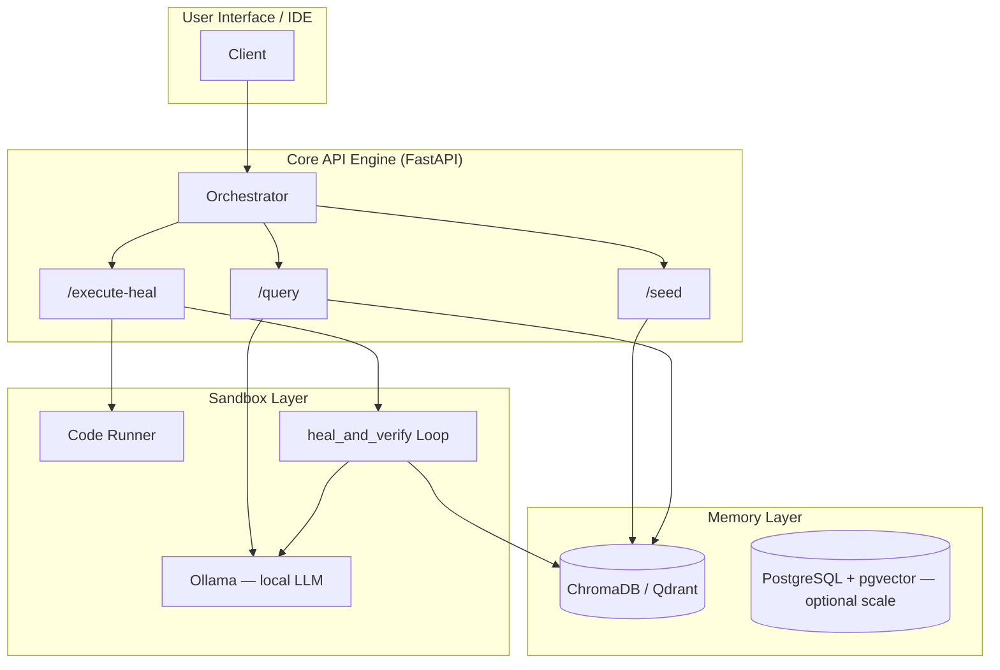

# Smart Code Library — Architecture Overview

The Smart Code Library is a self-healing, semantic code reference platform. It separates **data lookup** (vector memory) from **code execution** (sandbox), enabling fast retrieval and safe runtime evaluation with automatic error recovery.

## High-Level Component Diagram



## ASCII Overview

```
┌────────────────────────┐
│   User Interface / IDE │
└───────────┬────────────┘
            │
            ▼
┌────────────────────────┐
│     Core API Engine    │◀───▶ [Vector Cache Engine]
└───────────┬────────────┘
            │
┌───────────┴────────────┐
▼                        ▼
┌───────────────┐        ┌───────────────┐
│ Memory Layer  │        │ Sandbox Layer │
│ (Chroma /     │        │ (Docker /     │
│ Postgres)     │        │ In-process)   │
└───────────────┘        └───────────────┘
```

## Components

### 1. Orchestrator (`main.py`)

The FastAPI application coordinates all requests:

- **Async routing** for `/seed`, `/query`, `/execute-heal`, `/health`, and `/maintenance/deduplicate`
- Wires together `VectorMemoryStore` and `SelfHealingSandbox`
- Uses LangChain `ChatOllama` for local query synthesis and healing prompts (no API keys)

### 2. Memory Layer (`database/vector_store.py`)

- **VectorMemoryStore** wraps ChromaDB with local HuggingFace embeddings (`all-MiniLM-L6-v2`)
- Persists to `./.chroma_db`
- Supports `insert_reference()` and `query_context()` with category/language metadata
- Optional production path: Qdrant or PostgreSQL with `pgvector` for metadata filtering at scale

### 3. Sandbox Layer (`sandbox/code_runner.py`)

- **SelfHealingSandbox** executes Python in Docker-isolated containers (in-process fallback)
- On failure, invokes local Ollama LLM to produce JSON with `fixed_code` and `explanation`
- Successful patches are written back to the vector store as `"Self-Healing Patch"` entries
- Production target: Docker-isolated containers for stronger isolation

## Request Flows

| Endpoint | Flow |
|----------|------|
| `GET /health` | Client → Orchestrator → startup + Ollama availability check |
| `POST /seed` | Client → Orchestrator → VectorMemoryStore → ChromaDB |
| `POST /query` | Client → Orchestrator → similarity search → LLM answer with context |
| `POST /execute-heal` | Client → Sandbox execute → (on error) LLM fix loop → optional vector write-back |
| `POST /maintenance/deduplicate` | Client → Orchestrator → VectorMemoryStore deduplicate (exact + near-duplicate removal) |

## Project Layout

```text
smart_code_lib/
├── main.py
├── config.py
├── database/
│   ├── __init__.py
│   └── vector_store.py
├── llm/
│   ├── __init__.py
│   └── local_models.py
├── sandbox/
│   ├── __init__.py
│   └── code_runner.py
└── requirements.txt
```

## Design Principles

1. **Separation of concerns** — Retrieval and execution are independent subsystems.
2. **Self-improvement** — Failed runs that get fixed enrich the library for future queries.
3. **Low latency** — Local Chroma persistence avoids network round-trips in development.
4. **Production readiness** — Docker Compose bundles API + Qdrant for containerized deployment.