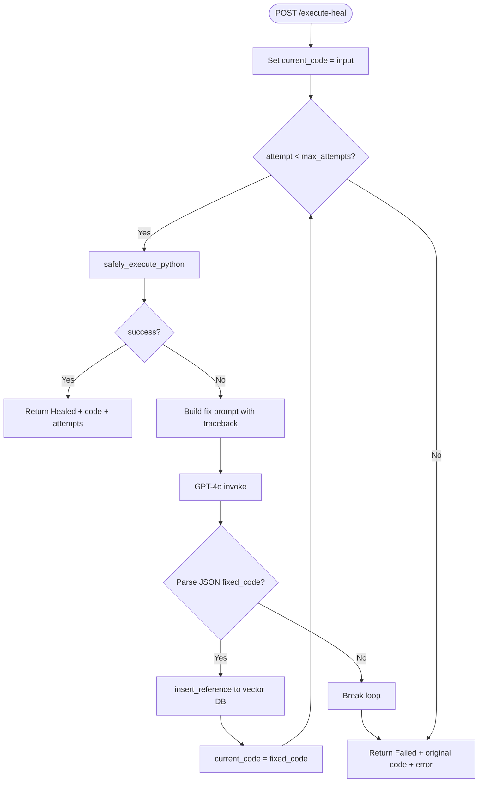

# Smart Code Library — Self-Healing Flow

How the `heal_and_verify` loop works, what gets stored in the vector database, and when healing succeeds or fails.

---

## Overview

The **SelfHealingSandbox** (`sandbox/code_runner.py`) executes user-submitted Python code. If execution fails, it uses GPT-4o to generate fixes, retries execution, and persists successful patches to the vector memory for future retrieval.

Entry point: `POST /execute-heal` → `sandbox.heal_and_verify(code)`

---

## Flow Diagram



---

## Step-by-Step

### 1. Initial Execution

`safely_execute_python(code_string)` (default: Docker-isolated):

- When `USE_DOCKER_SANDBOX` is not `false`, runs code in an ephemeral `python:3.11-slim` container via `execute_in_docker`
- Container constraints: `--network none`, `--memory 128m`, `--cpus 0.5`, read-only rootfs, code via stdin
- Falls back to in-process `exec()` only when Docker is unavailable or `USE_DOCKER_SANDBOX=false`
- Captures stdout and exception tracebacks from the container or in-process runner
- Returns:

```python
{
    "success": bool,
    "stdout": str,
    "error_traceback": str | None
}
```

### 2. Success Path

If `success` is `True` on any attempt:

```python
{
    "status": "Healed",
    "code": current_code,      # may equal original or fixed version
    "attempts": attempt + 1    # 1-based attempt count
}
```

> Code that runs correctly on the **first** attempt still returns `status: "Healed"` with `attempts: 1`.

### 3. Failure Path — LLM Fix

On execution failure, the sandbox sends a prompt to GPT-4o:

```
Fix this code. Return a valid JSON dictionary string containing keys: 'fixed_code' and 'explanation'.

Code to fix:
{current_code}

Error Details:
{error_traceback}
```

Expected LLM response format:

```json
{
  "fixed_code": "...",
  "explanation": "..."
}
```

### 4. Vector DB Write-Back

When JSON parsing succeeds, before the next retry:

```python
db.insert_reference(
    content=f"Fixed error: {traceback}. Fix: {explanation}",
    category="Self-Healing Patch"
)
```

| Stored Field | Value |
|--------------|-------|
| `page_content` | Error traceback + human-readable fix explanation |
| `metadata.category` | `"Self-Healing Patch"` |
| `metadata.language` | `"All"` (default) |

These entries enrich `/query` results so similar errors can be resolved from past fixes.

### 5. Retry Loop

- `current_code` is updated to `fixed_code`
- Loop continues until success or limits are hit

### 6. Terminal Failure

If all attempts fail or LLM output cannot be parsed:

```python
{
    "status": "Failed",
    "code": broken_code,           # original input, not last attempted fix
    "error": result["error_traceback"]
}
```

---

## Configuration

| Parameter | Default | Location |
|-----------|---------|----------|
| `max_attempts` | **3** | `heal_and_verify(broken_code, max_attempts=3)` |
| `USE_DOCKER_SANDBOX` | **true** | `.env` / environment; set `false` for in-process `exec()` only |
| Docker execution timeout | **30s** | `safely_execute_python(..., timeout=30)` |
| LLM model | `llama3.2` (local) | `ChatOllama` via Ollama — no API key |
| LLM temperature | `0` | Deterministic fix generation |

---

## Attempt Budget Example

| Attempt | Action | Outcome |
|---------|--------|---------|
| 1 | Run original code | Fails → LLM fix → store patch |
| 2 | Run fixed code v1 | Fails → LLM fix → store patch |
| 3 | Run fixed code v2 | Succeeds → return `Healed`, `attempts: 3` |

Maximum **3 executions** per request (not 3 LLM calls after success).

---

## What Gets Stored vs What Does Not

| Event | Stored in Vector DB? |
|-------|----------------------|
| Successful heal after error | **Yes** — patch + explanation |
| First-attempt success (no error) | **No** |
| Failed heal (all attempts exhausted) | **No** (only successful parse paths write) |
| LLM parse failure (invalid JSON) | **No** — loop breaks immediately |

---

## Security Considerations

- Default sandbox runs user code in ephemeral Docker containers (`execute_in_docker`) with no network, memory/CPU limits, and read-only root filesystem
- `docker-compose.yml` mounts the Docker socket into `api_server` so it can spawn sandbox containers; this grants significant host control — restrict API access in production
- In-process `exec()` fallback is used only when Docker is unavailable or `USE_DOCKER_SANDBOX=false` (dev/trusted use)
- Docker execution enforces a **30s** timeout per run; in-process fallback has no timeout

---

## Related Endpoints

- **`POST /execute-heal`** — Triggers this flow
- **`POST /query`** — May retrieve past `"Self-Healing Patch"` entries for similar problems
- **`POST /seed`** — Manual alternative to populate fixes without execution